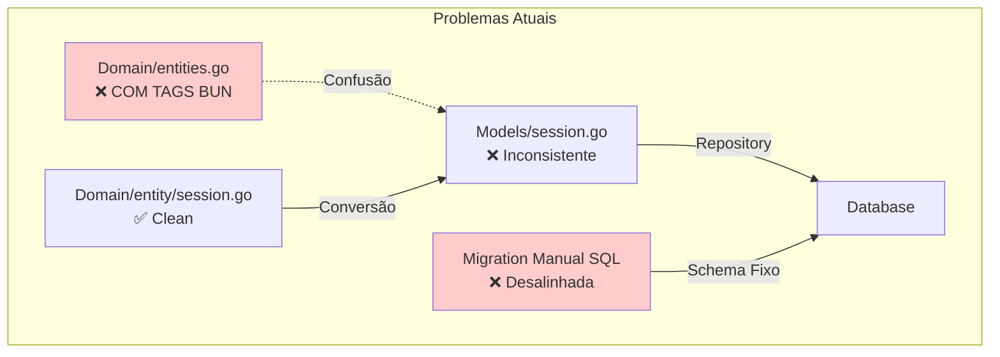
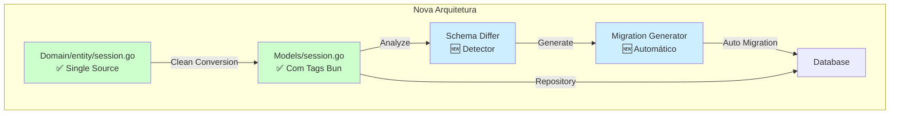
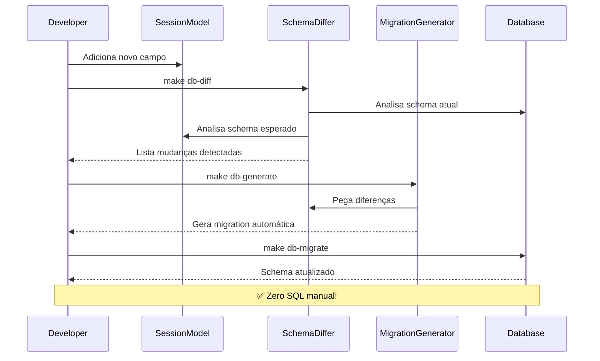
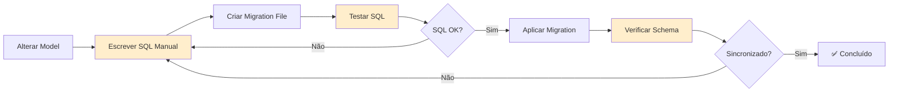
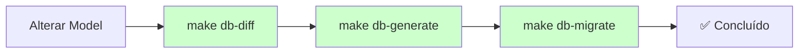
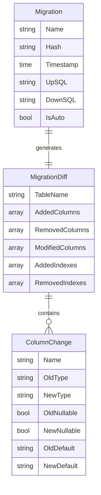
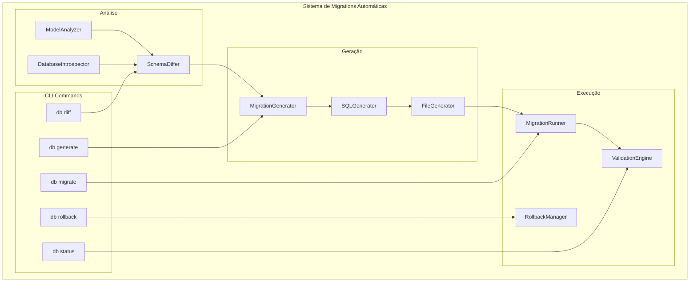
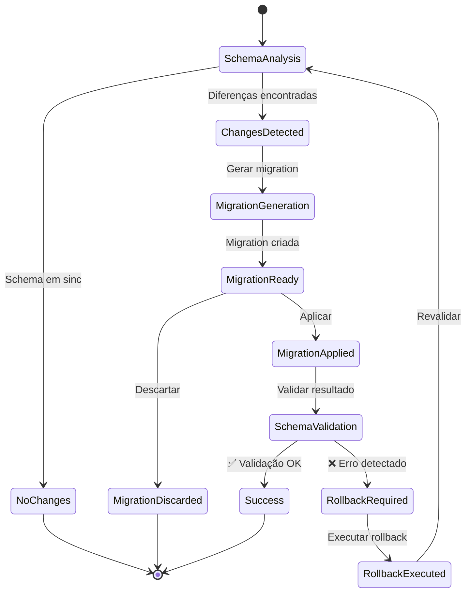
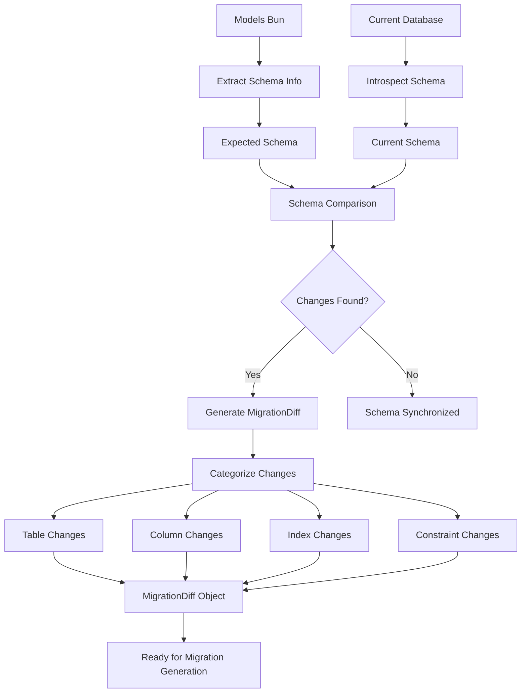

# Diagramas da Arquitetura de Migrations Automáticas

## 🏗️ Arquitetura Atual vs Proposta

### Arquitetura Atual (Problemática)

### Arquitetura Proposta (Solução)

## 🔄 Fluxo de Desenvolvimento com Migrations Automáticas

## 📊 Comparação: Manual vs Automático

### Fluxo Manual Atual

### Fluxo Automático Proposto  

## 🗄️ Estrutura de Dados da Migration

## 🔧 Componentes do Sistema

## 📈 Timeline de Implementação

```mermaid
gantt
    title Cronograma de Implementação
    dateFormat X
    axisFormat %d
    
    section Fase 1: Limpeza
    Remover entities.go        :done, p1, 0, 1
    Padronizar entity/session  :done, p2, 1, 2
    Atualizar SessionModel     :active, p3, 2, 4
    
    section Fase 2: Sistema Base
    SchemaDiffer              :p4, 4, 6
    MigrationGenerator        :p5, 6, 8
    CLI Commands              :p6, 7, 9
    
    section Fase 3: Migração
    Converter migration atual  :p7, 8, 10
    Testes de validação       :p8, 9, 11
    
    section Fase 4: Finalização
    Documentação              :p9, 10, 12
    Validação completa        :p10, 11, 13
```

## 🎯 Estados do Sistema

## 🔍 Detalhes Técnicos do SchemaDiffer

---

Estes diagramas fornecem uma visão visual completa da arquitetura proposta e dos fluxos de trabalho que implementaremos.